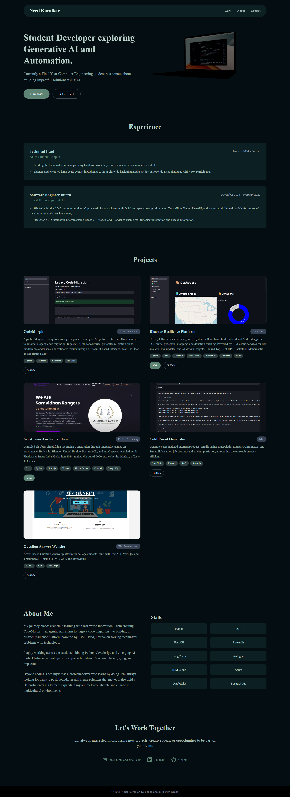

# Personal Portfolio Website


A personal **portfolio website** showcasing my skills, projects, and experiences, featuring an interactive 3D laptop model built with **React Three Fiber** and styled with **Tailwind CSS**.

---

## ✨ Features

- **3D Animated Laptop** — built using **React Three Fiber**, allowing users to control rotation and interaction.
- **Responsive Design** — optimized for desktop, tablet, and mobile devices.
- **Modern UI** — styled with Tailwind CSS for a clean and consistent look.
- **Projects Showcase** — highlights selected projects with descriptions, tags, and live/demo links.
- **Experience Section** — displays professional roles and achievements.
- **Skills Grid** — quick view of my technical skill set.
- **Contact Section** — easy ways to connect via email and social platforms.

---

## 🛠️ Tech Stack

- **Frontend Framework**: [React.js](https://react.dev/)
- **Styling**: [Tailwind CSS](https://tailwindcss.com/)
- **3D Rendering**: [React Three Fiber](https://docs.pmnd.rs/react-three-fiber/getting-started/introduction)
- **Icons**: [React Icons](https://react-icons.github.io/react-icons/)
- **Deployment**: GitHub Pages

---

## 📁 Folder Structure

```
PORTFOLIO-WEBSITE/
├── public/
│   ├── favicon.png
│   ├── mac-draco.glb
│   └── screenshot/
│       └── screenshot.png
│
├── src/
│   ├── assets/
│   ├── components/
│   │   ├── About.jsx
│   │   ├── Contact.jsx
│   │   ├── Footer.jsx
│   │   ├── Hero.jsx
│   │   ├── Laptop.jsx
│   │   ├── Navigation.jsx
│   │   ├── ProjectCard.jsx
│   │   ├── Projects.jsx
│   │   └── WorkExperience.jsx
│   ├── App.css
│   ├── App.jsx
│   ├── index.css
│   └── main.jsx
│
├── .gitignore
├── eslint.config.js
├── index.html
├── package-lock.json
├── package.json
├── postcss.config.cjs
└── README.md
```

## 🚀 Getting Started

### 1. Clone the Repository
```bash
git clone https://github.com/<your-username>/<repo-name>.git
cd <repo-name>
```

### 2. Install Dependencies
```bash
npm install
```

### 3. Run Development Server
```bash
npm run dev
```
Open `http://localhost:5173` in your browser.

### 4. Build for Production
```bash
npm run build
```

---

## 🌐 Deployment

This portfolio is deployed using **GitHub Pages**.

To deploy:

For GitHub Pages with Vite:
```bash
npm install gh-pages --save-dev
```
Update `package.json`:
```json
"homepage": "https://yourusername.github.io/portfolio-website",
"scripts": {
  "predeploy": "npm run build",
  "deploy": "gh-pages -d dist"
}
```
Then run:
```bash
npm run deploy
```
Your site will be live at:
```
https://<your-username>.github.io
```

---

## 📸 Preview



---

## 📬 Contact

- **Email**: [neetikurulkar@gmail.com](mailto:neetikurulkar@gmail.com)
- **LinkedIn**: [linkedin.com/in/neetikurulkar](https://linkedin.com/in/neetikurulkar)
- **GitHub**: [github.com/neetikurulkar](https://github.com/neetikurulkar)

---

